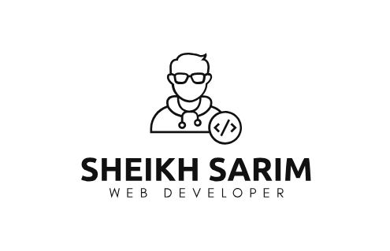

 

  

  

- 🕰️💪I am currently investing time in **skill improvement to excel in my profession.**

- 🌱 Currently enrolled in the **The Aptech Certified Computer Professional (ACCP) course**

- 👯 I am currently developing **Web APIs** as part of my ongoing projects.

- 💬 Ask me about **HTML, CSS, JavaScript, Bootstrap, PHP, C# , ASP .NET ,Angular**

- 📫 How to reach me **<sarimaw1120@gmail.com>**

- ⚡ Fun fact **I love Cars(🚗), Codeing(💻), Traveling(🌍), and Photography(📷).**

<h3 align="center">Connect with me:</h3>

<h3 align="center">Languages and Tools:</h3>
<table align="center">
    <tr>
        <td style="font-weight: bold; padding-right: 10px; vertical-align: center;">Backend:</td>
        <td></td>
    </tr>
    <tr>
        <td style="font-weight: bold; padding-right: 10px; vertical-align: center;">Frontend:</td>
        <td></td>
    </tr>
    <tr  >
        <td style="font-weight: bold; padding-right: 10px; vertical-align: center; border: none;">Database:</td>
        <td></td>
    </tr>
    <tr>
        <td style="font-weight: bold; padding-right: 10px; vertical-align: center; border: none;">Version Control:</td>
        <td></td>
    </tr>
    <tr>
        <td style="font-weight: bold; padding-right: 10px; vertical-align: center; border: none;">Code Editors:</td>
        <td></td>
    </tr>
    <tr>
      <td style="font-weight: bold; padding-right: 10px; vertical-align: center; border: none;">Other Tools:
      </td>
      <td>
        
        
        
      </td>
    </tr>
</table>
